+++
title = "cccg"
[extra]
state = "ongoing"
+++

A card game designed to be played asynchronously between many players.  
The game revolves around the creation and exchange of cards.

<!-- more -->
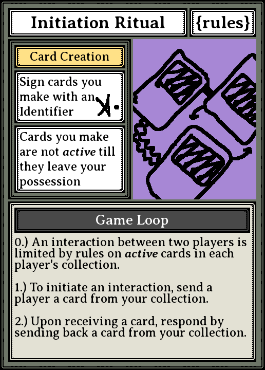

# Rules
block of rules, explanation

# Design Intent
The design of this game was after the fact influenced by
[1000 Blank White Cards](https://en.wikipedia.org/wiki/1000_Blank_White_Cards)

Here is a selection of cards made before the first playtest.
This version was played digitally and mostly synchronously in one play session using a network share directory in which players exchanged cards.
This set of cards played on the movement and positioning of cards within players' Active and Inactive collections.

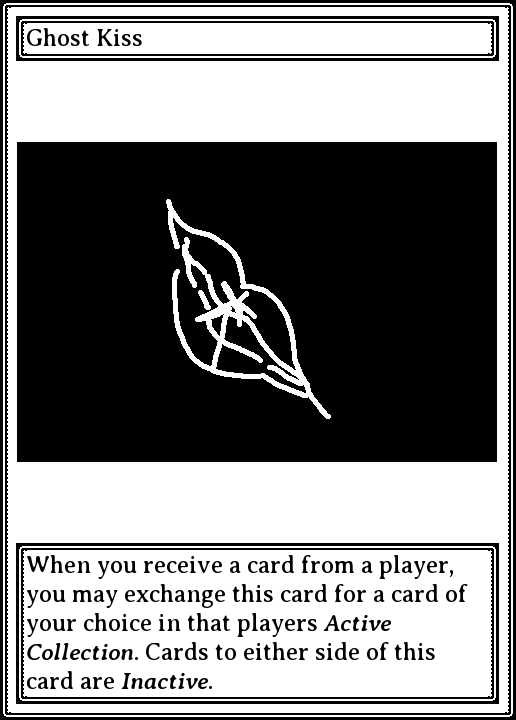
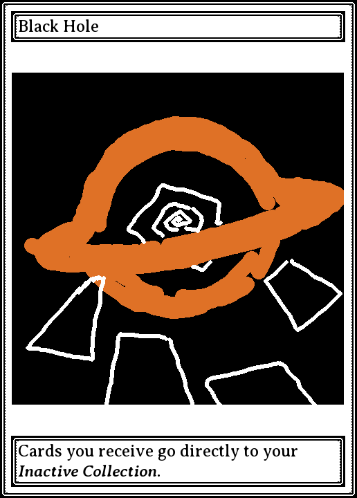
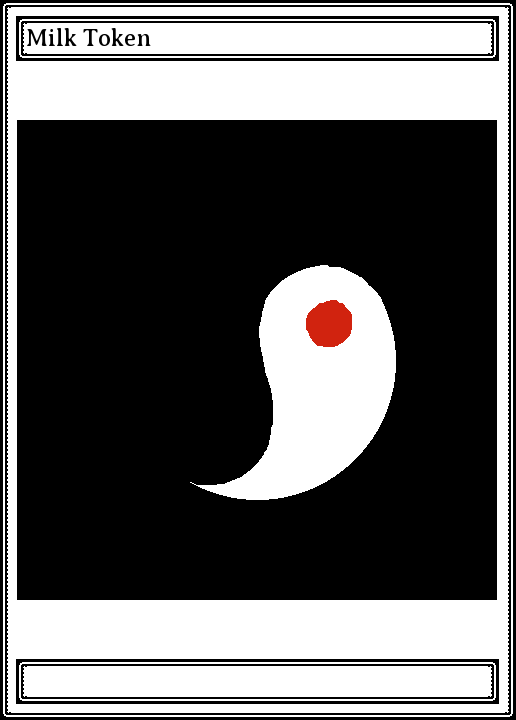
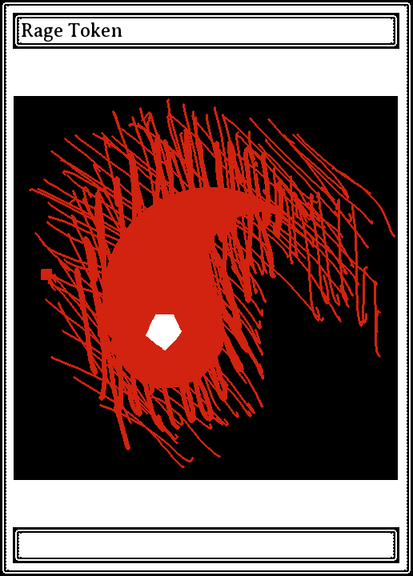
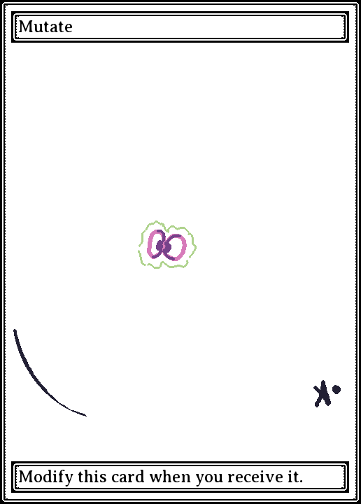
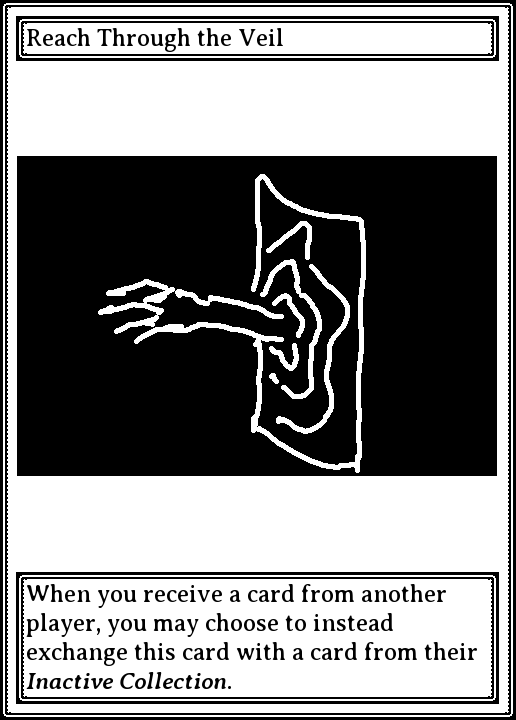
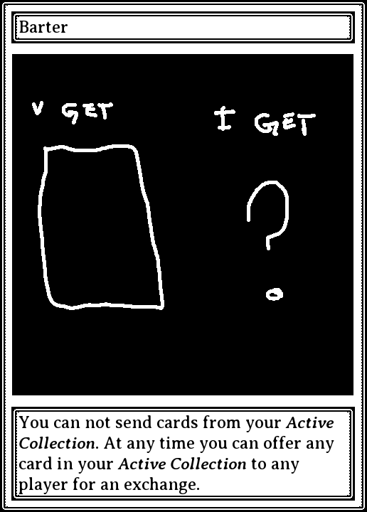
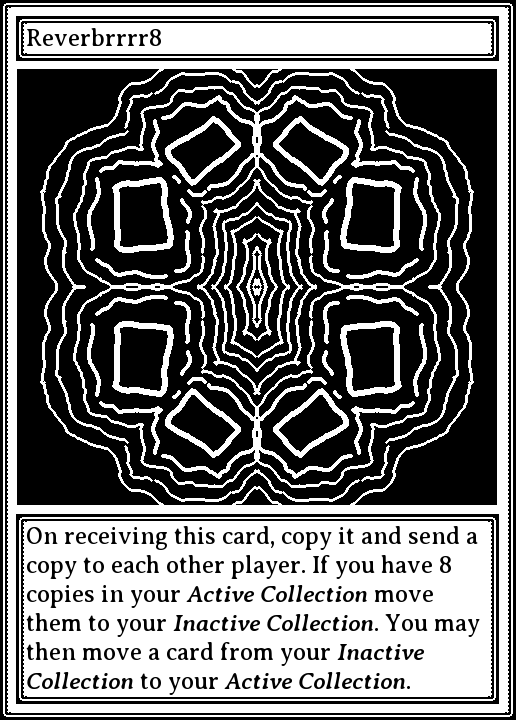
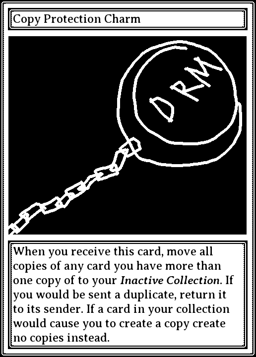
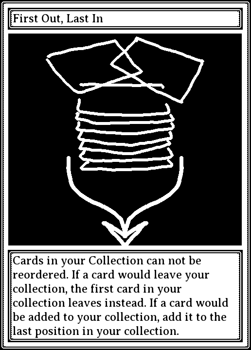
