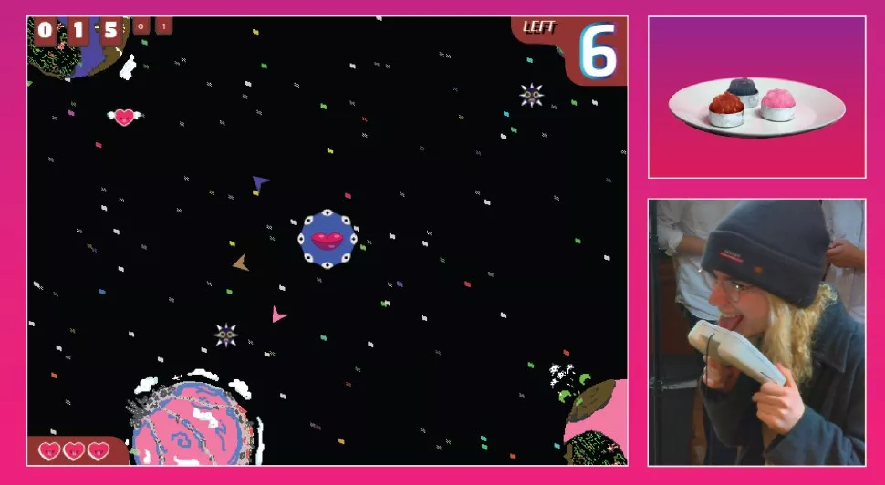

+++
title = "planet licker"
[extra]
state = "complete"
+++

An edible Alt-Ctrl game played with a conductive popsicle bearing controller.
<!-- more -->

[Planet Licker](https://a-o.in/games/pl/#content) was conceived in 2015 for the LD33 jam and developed into 2016 when it was shown as part of the GDC alt.ctrl showcase.

### Press
{{ youtube (id="eysOtjfMBb4", class="video-container") }}

* [gamedeveloper.com](https://www.gamedeveloper.com/design/alt-ctrl-gdc-showcase-i-planet-licker-i-)
* [Killscreen](https://killscreen.com/previously/articles/planet-licker-a-game-that-you-play-with-your-tongue/)
* [PC Gamer](https://www.pcgamer.com/planet-licker-is-a-game-you-literally-play-with-your-tongue/)
* [Gameskinny](https://www.gameskinny.com/6tvco/planet-licker-the-game-you-lick-the-controller-to-play)
* [Gamesradar](https://www.gamesradar.com/controller-licking-game-planet-licker/)
* [Vice](https://www.vice.com/en/article/8qvbkv/planet-licker-popsicle-controller-videogame)
* [MIT Tech Review](https://www.technologyreview.com/2016/06/28/108243/tasting-victory-why-gamers-are-hacking-taste-and-smell/)
